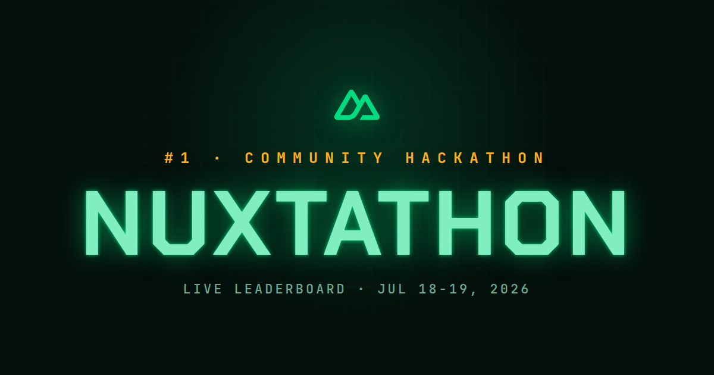

# Nuxtathon Leaderboard



A live leaderboard for Nuxtathon, the community hackathon on the `nuxt/nuxt`
repository ([announcement](https://github.com/nuxt/nuxt/issues/35561)). During
the event it ranks contributors by the number of qualifying issues their merged
pull requests closed, and reshuffles in real time. When the event is over an
admin freezes the result and the winner is revealed.

Built with Nuxt 4, Nitro, Pinia, and UnoCSS.

## How scoring works

A pull request counts toward a contributor's score when all of these hold:

- It was **created** inside the event window (`startsAt` to `endsAt`). Submission
  time is the rule, not merge time, so a PR opened during the event still counts
  if it is merged later.
- It has been **merged**.
- It **closes at least one issue** created before `qualifyingBefore`.

**Who gets credit.** Every contributor to a qualifying PR, not just the opener:
the commit authors and any `Co-authored-by` names that resolve to a GitHub
account each get full credit. Issues are deduped per person, so the same issue
counts once even if it shows up on more than one of their PRs.

**Who is excluded.** Bots (GitHub Apps, `[bot]` accounts like `renovate[bot]`,
and AI co-author attributions such as `claude`) and the core team listed in
`coreTeam`. Core team contributions are still tallied and archived, just kept out
of the prize ranking.

Score = qualifying closed issues + manual credits (see Admin). The board shows
the merged-PR count as a secondary stat, plus window-wide counters for submitted
and merged PRs (both bot-free).

## Configuration

Static event config lives in `config/event.json`:

| Field              | Meaning                                            |
| ------------------ | -------------------------------------------------- |
| `title`            | Hero title, e.g. "Nuxtathon"                       |
| `eyebrow`          | Kicker above the title                             |
| `description`      | Short blurb, Markdown                              |
| `startsAt`         | Event start, ISO 8601 UTC                          |
| `endsAt`           | Event end, ISO 8601 UTC                            |
| `qualifyingBefore` | Issues created before this instant qualify         |
| `coreTeam`         | GitHub logins kept out of the ranking (organizers) |
| `displayTimeZone`  | IANA zone for rendering dates, e.g. "UTC"          |

Dates are absolute UTC instants; the timezone only affects display.

## Environment

Copy `.env.example` to `.env` and fill it in:

```
NUXT_GITHUB_TOKEN=      # read access to public repos is enough
NUXT_ADMIN_USER=        # admin login
NUXT_ADMIN_PASSWORD=    # use a strong, random password in production
```

## Development

```bash
pnpm install
pnpm dev
```

Lint and format with `pnpm lint` and `pnpm fmt`. Runtime state (frozen result,
credits, snapshots, cache) is written to `.data` via the filesystem driver.

## Event lifecycle

The public page follows four phases, derived from the config dates and the admin:

1. `upcoming`: before `startsAt`. Intro plus a countdown to the start.
2. `live`: between `startsAt` and `endsAt`. The leaderboard, refreshing itself.
3. `evaluating`: after `endsAt`, before the admin fires. An "evaluation running"
   screen while the last PRs are merged.
4. `results`: after the admin fires. The winner is revealed and the board frozen.

GitHub is queried at most once every 5 minutes (cached, stale-while-revalidate).
Open pages poll every 2 minutes during `live`, so the board reshuffles without a
reload.

## Admin

Visit `/admin` and log in with the env credentials. Actions:

- **Fire**: freeze the ranking, release prizes, archive the result, and reveal
  the winner. This stops the count, so late merges no longer move the board. Use
  it during `evaluating`, or earlier if you must end the event before the clock.
- **Unfreeze**: undo a fire and go back to the live leaderboard.
- **Refresh**: drop the cache and recompute from GitHub now.
- **Reset**: clear the live event (frozen result, credits, snapshots) to make
  room for a new Nuxtathon. The archived result is kept.
- **Manual credits**: add points to a contributor for an issue closed without a
  PR, for example a non-reproducible issue you close and credit the reporter. The
  standings preview updates live; Save persists.
- **Archive**: past finalized events, downloadable as JSON per event or all at
  once.

The admin API uses HTTP Basic Auth with a timing-safe comparison and a per-IP
failure throttle. Serve the app over HTTPS, since Basic Auth depends on it.

## Starting a new Nuxtathon

`config/event.json` is part of the build, so a new event means shipping an
updated build plus a reset:

1. Update `config/event.json` (title, dates, `qualifyingBefore`, description).
2. Optionally download the current archive from `/admin` as a backup.
3. Deploy the new build.
4. In `/admin`, press **Reset** to clear the previous event's frozen state.

The archive persists across the reset.

## Contributing

See [CONTRIBUTING.md](./CONTRIBUTING.md).

## License

MIT (c) [Florian Heuberger](https://heuberger.dev). See [LICENSE](./LICENSE).

## Credit

Made with love by [Flo Heuberger](https://heuberger.dev).
